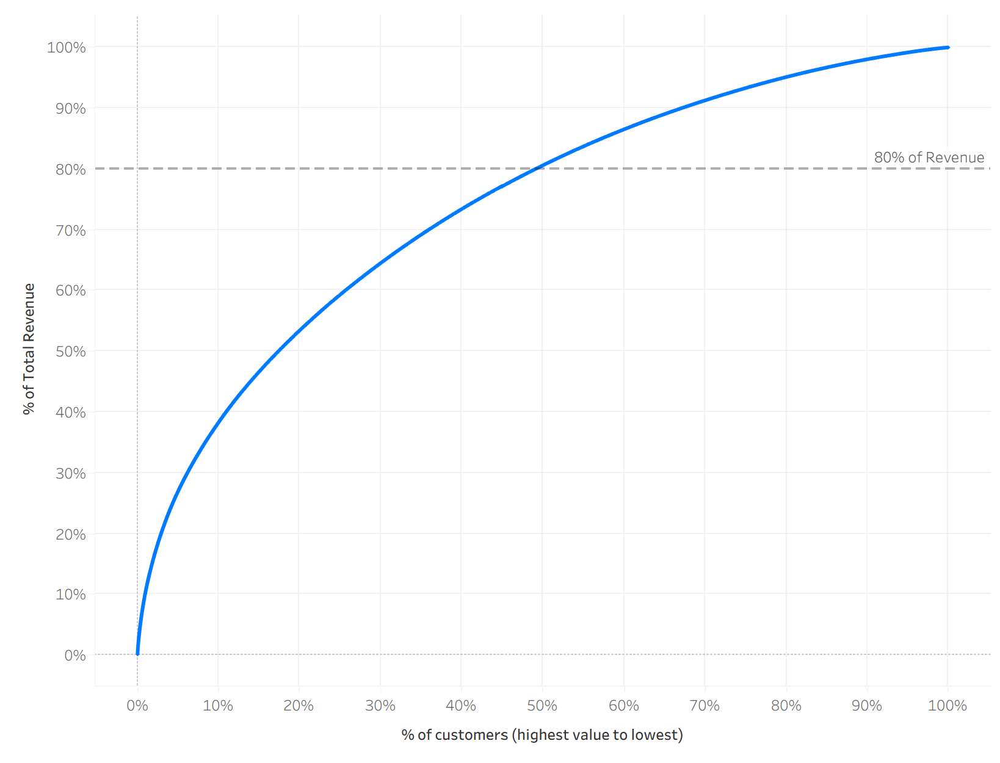
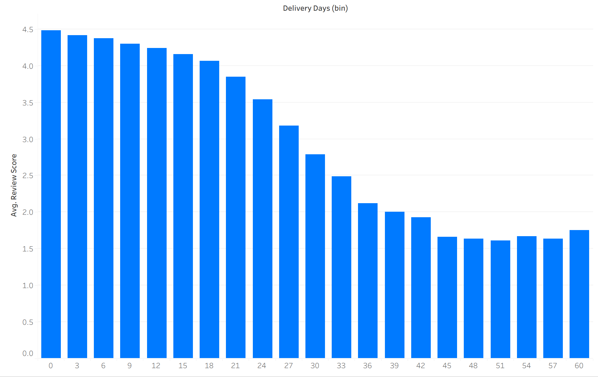

# Olist Revenue and Customer Satisfaction

## Overview

**Business Question:** How concentrated is customer revenue, how much revenue is at risk, and does delivery performance measurably affect customer satisfaction?

**Data Source:** [Brazilian E-Commerce Public Dataset by Olist](https://www.kaggle.com/datasets/olistbr/brazilian-ecommerce)

---

## Data and Analytical Approach

1. Data was transformed into a single analytical table at the customer level by joining order, payment, item, and review data.
2. Data quality issues included missing payment records, duplicate reviews, and inconsistent delivery timestamps. These were handled with conditional logic and validation flags.
3. Revenue was defined by aggregating payment values, and invalid or inconsistent records were retained and flagged to preserve flexibility in analysis.

## Analysis

### **Revenue Leakage**

#### Findings

The overwhelming majority of revenue from orders in the Olist tables was realized, accounting for approximatly 96% of total revenue. A small, but measurable amount of revenue (~3%) is at risk, composed primarily of orders that were not delivered when the data was collected. Lost revenue from cancelled orders accounted for less than 1% of potential revenue.

#### Summary

Revenue leakage appears to be minimal. Assuming the fulfillment trend continues, much of the at-risk revenue will be realized. This data indicates there is little concern of leakage. However, the dataset contains no information on returned orders, meaning additional revenue leakage may exist outside the scope of this analysis.

### **Customer Value**

<h3 align="center">Percentage of Revenue x Percentage of Customers</h3>

#### Findings

Customer revenue is moderately concentrated among a subset of users. The cumulative revenue curve shows that approximately 50% of customers account for 80% of total revenue. Although roughly 94% of customers are one-time buyers, this revenue distribution suggests that retention efforts focused on these higher-value customers would be more effective than broad retention strategies.

### **Operational Impact**

<h3 align="center">Average Review Score x Delivery Lead Time </h3>

#### Findings

Delivery performance shows a measurable relationship with customer satisfaction. Orders with the shortest delivery times tend to receive higher review scores, while review scores generally decline as delivery times increase.

#### Summary

Delivery performance appears to be positively associated with customer satisfaction. Although this relationship is not perfectly linear, the weakening of the trend in later delivery periods is likely influenced by increasingly sparse observations.

### Conclusion:

1. Revenue loss from canceled or incomplete orders appears to be minimal.
2. Customer value is moderately concentrated, with approximatley 50% of customers contributing 80% of revenue.
3. Delivery performance shows a measurable relationship with customer satisfaction.

### Recommendations:

1. Develop retention strategies that target the top 50% of customers.
2. Improve delivery performance to support stronger customer satisfaction.
